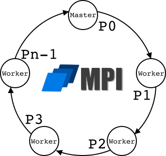

# <div style="text-align:center"> Lexxeous's MPI Ring: 

## Summary and Semantics:
This is a simple parallel processing program that creates a ring of communicative processes using [C](https://en.wikipedia.org/wiki/C_(programming_language)) and [MPI](https://en.wikipedia.org/wiki/Message_Passing_Interface). It creates a ring, of user defined size `Pn`, between 3 and 8, inclusive (`3 ≤ n ≤ 8`). The ring is 0-indexed, therefore, the **master** process is labeled as `P0`, while the **worker** processes are labeled as `P1` through `Pn-1`. The master process `P0` will initiate the message ring by passing the original string and integer to its next immediate worker `P1`. The worker processes, `P1` through `Pn-1`, will pass the string and the integer to their next neighbors after appending their **rank** and incrementing the integer. The master process `P0` will receive the modified string and integer from `Pn-1`, append its rank, and increment the integer, one last time.

## Expectations and Execution:
The program only expects 3 command line arguments. The first command line argument expects the **executable**. The second command line argument expects a user input **string** of length ≤ 100. The third command line argument expects an numeric, **integer** value. The steps for program execution are as follows:

1. Reserve `Pn` processes on a computing node (I used a university hosted HPC server).
  * `hpcshell --tasks-per-node=<Pn>`
2. Use `make` to call the `comp` target from `Makefile` for compilation.
  * `make comp` -> `mpicc -o <executable> mpi_ring.c`
3. Use `make` to call the `run` target from `Makefile` for execution. Make sure to follow the expectations for the command line arguments, match `Pn`, and match the executable name.
  * `make run` -> `mpirun -np <Pn> ./<executable> <string> <integer>`
4. Use `make` to call the `clean` target from `Makefile` to remove the executable from the current directory.
  * `make clean` -> `rm <executable>`


## Result with 8 Processes:

Execution Commands:
```sh
>> hpcshell --tasks-per-node=8
>> make comp
   mpicc -o mpi_ring mpi_ring.c
>> make run
   mpirun -np 8 ./mpi_ring testing_ring 1
```

Output:
```
Starting MPI ring of size 8...
Original message: testing_ring
Original value: 8675309

Message at process 1: testing_ring1
Value at process 1: 8675310

Message at process 2: testing_ring12
Value at process 2: 8675311

Message at process 3: testing_ring123
Value at process 3: 8675312

Message at process 4: testing_ring1234
Value at process 4: 8675313

Message at process 5: testing_ring12345
Value at process 5: 8675314

Message at process 6: testing_ring123456
Value at process 6: 8675315

Message at process 7: testing_ring1234567
Value at process 7: 8675316

Message at process 0: testing_ring12345670
Value at process 0: 8675317
```

## Result with 5 Processes:

Execution Commands:
```sh
>> hpcshell --tasks-per-node=5
>> make comp
   mpicc -o mpi_ring mpi_ring.c
>> make run
   mpirun -np 5 ./mpi_ring ring 5000
```

Output:
```
Starting MPI ring of size 5...
Original message: ring
Original value: 5000

Message at process 1: ring1
Value at process 1: 5001

Message at process 2: ring12
Value at process 2: 5002

Message at process 3: ring123
Value at process 3: 5003

Message at process 4: ring1234
Value at process 4: 5004

Message at process 0: ring12340
Value at process 0: 5005
```

## Result with 3 Processes:

Execution Commands:
```sh
>> hpcshell --tasks-per-node=3
>> make comp
   mpicc -o mpi_ring mpi_ring.c
>> make run
   mpirun -np 3 ./mpi_ring string 80
```

Output:
```
Starting MPI ring of size 3...
Original message: string
Original value: 80

Message at process 1: string1
Value at process 1: 81

Message at process 2: string12
Value at process 2: 82

Message at process 0: string120
Value at process 0: 83
```

## Result with 9 Processes:

Execution Commands:
```sh
>> hpcshell --tasks-per-node=9
>> make comp
   mpicc -o mpi_ring mpi_ring.c
>> make run
   mpirun -np 9 ./mpi_ring string 80
```

Output:
```txt
ERR:9:WRLDSZ >> Number of processes must be between 3 and 8 for ./mpi_ring.
--------------------------------------------------------------------------
MPI_ABORT was invoked on rank 0 in communicator MPI_COMM_WORLD
with errorcode 9.

NOTE: invoking MPI_ABORT causes Open MPI to kill all MPI processes.
You may or may not see output from other processes, depending on
exactly when Open MPI kills them.
--------------------------------------------------------------------------
make: *** [run] Error 9
```

## Result with 2 Processes:

Execution Commands:
```sh
>> hpcshell --tasks-per-node=2
>> make comp
   mpicc -o mpi_ring mpi_ring.c
>> make run
   mpirun -np 2 ./mpi_ring string 80
```

Output:
```txt
ERR:2:WRLDSZ >> Number of processes must be between 3 and 8 for ./mpi_ring.
--------------------------------------------------------------------------
MPI_ABORT was invoked on rank 0 in communicator MPI_COMM_WORLD
with errorcode 2.

NOTE: invoking MPI_ABORT causes Open MPI to kill all MPI processes.
You may or may not see output from other processes, depending on
exactly when Open MPI kills them.
--------------------------------------------------------------------------
make: *** [run] Error 2
```

## Result with too many command line arguments:

Execution Commands:
```sh
>> hpcshell --tasks-per-node=5
>> make comp
   mpicc -o mpi_ring mpi_ring.c
>> make run
   mpirun -np 5 ./mpi_ring ring 100 test
```

Output:
```txt
ERR:3:ARGC >> Wrong number of command line arguments.
Use ./<executable> <string> <integer> as format.
-------------------------------------------------------
Primary job  terminated normally, but 1 process returned
a non-zero exit code.. Per user-direction, the job has been aborted.
-------------------------------------------------------
--------------------------------------------------------------------------
mpirun detected that one or more processes exited with non-zero status, thus causing
the job to be terminated. The first process to do so was:

  Process name: [[17468,1],0]
  Exit code:    253
--------------------------------------------------------------------------
```

## Result with an exceedingly long input string:

Execution Commands:
```sh
>> hpcshell --tasks-per-node=7
>> make comp
   mpicc -o mpi_ring mpi_ring.c
>> make run
   mpirun -np 7 ./mpi_ring s0123456789012345678901234567890123456789012345678901234567890123456789012345678901234567890123456789 1
```

Output:
```txt
ERR:0:STR >> The second command line argument must be a string of size ≤ 100.
--------------------------------------------------------------------------
MPI_ABORT was invoked on rank 0 in communicator MPI_COMM_WORLD
with errorcode 0.

NOTE: invoking MPI_ABORT causes Open MPI to kill all MPI processes.
You may or may not see output from other processes, depending on
exactly when Open MPI kills them.
--------------------------------------------------------------------------
make: *** [run] Error 0
```
